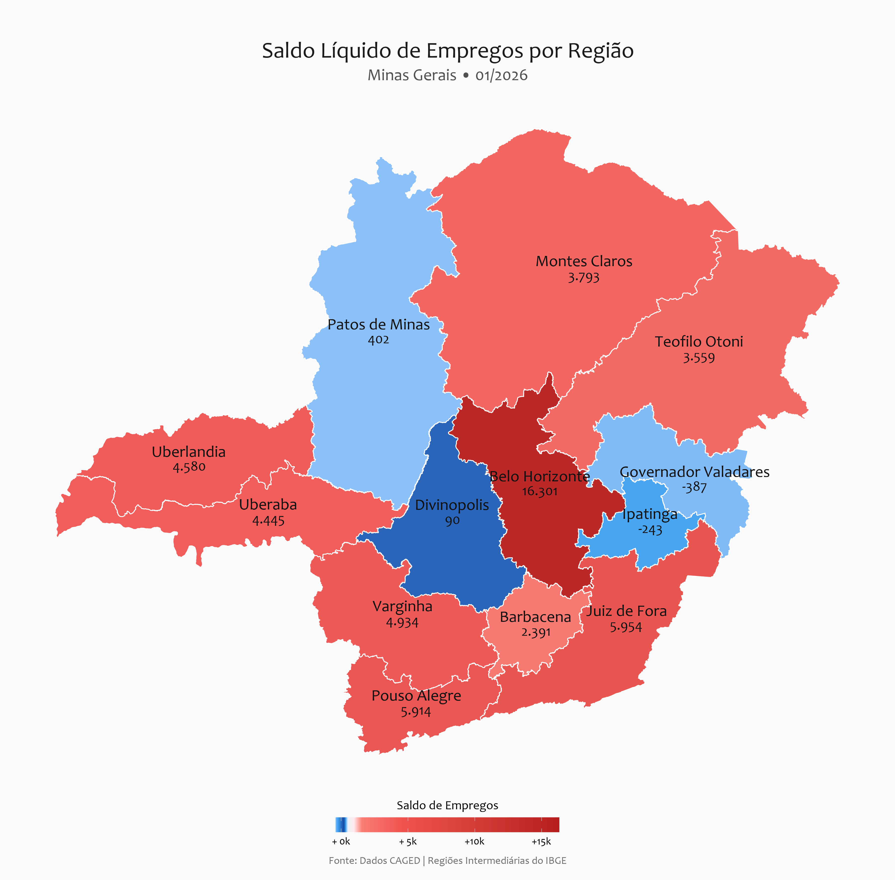

# Saldo de Empregos nas Regioes Intermediarias de Minas Gerais

Projeto em R para transformar uma base agregada do Novo Caged em uma visualizacao geografica por Regioes Intermediarias do IBGE em Minas Gerais.

O objetivo aqui nao e apenas gerar um mapa, mas mostrar uma entrega com cara de portfolio: codigo organizado, documentacao clara e um ativo visual facil de publicar no GitHub e no LinkedIn.

## O que este projeto mostra

- Leitura de uma base simples com tres colunas: `Regioes`, `Saldo` e `Ano`.
- Tratamento e padronizacao dos nomes das regioes.
- Integracao com a malha territorial do pacote `{geobr}`.
- Geracao de um mapa coropletico com destaque para o saldo de empregos por regiao.

## Estrutura

```text
.
|-- dados/
|   |-- saldo_de_emprego_nas_regioes.csv
|   `-- README.md
|-- graficos/
|   `-- mapa_rgint_mg_<ano>.png
|-- scripts/
|   `-- gerar_mapa_rgint_mg.R
```

## Base utilizada

A base publicada neste repositorio esta em `dados/saldo_de_emprego_nas_regioes.csv`, com as colunas:

- `Regioes` (o script tambem aceita o cabecalho com acento)
- `Saldo`
- `Ano`

O script procura primeiro pelo `CSV` em `dados/`. Como fallback, ele tambem aceita a planilha Excel original na raiz do projeto.

## Visual



## Como executar

1. Instale os pacotes necessarios:

```r
install.packages(c("readxl", "dplyr", "ggplot2", "geobr", "sf", "scales"))
```

2. Use o `CSV` ja incluido em `dados/` ou, se preferir, substitua pelos seus dados atualizados.

3. Rode o script:

```r
source("scripts/gerar_mapa_rgint_mg.R")
```

4. O mapa final sera salvo em `graficos/` com nome no formato `mapa_rgint_mg_<ano>.png`.

## Insight principal da base atual

Na base hoje presente no projeto, o ano mais recente e **2026**. Nesse recorte, excluindo a Regiao Metropolitana de Belo Horizonte, **Juiz de Fora** aparece entre os principais destaques do saldo de empregos no estado.

Se voce tiver a abertura setorial que sustenta essa leitura, vale reforcar na postagem que o desempenho foi puxado por **servicos**. Esse tipo de interpretacao ajuda a transformar um grafico bonito em narrativa de politica publica.

## Observacoes de reprodutibilidade

- O download da malha geografica depende do `{geobr}` e pode exigir internet na primeira execucao.
- O arquivo original `mapa_rgint_mg.qmd` foi mantido como rascunho de trabalho. O script em `scripts/` e a versao mais limpa para publicar.
- A nomenclatura antiga `mapa_2025.png` gerava ambiguidade com um filtro em `2026`. Nesta versao, o nome do arquivo acompanha o ano mais recente encontrado na base.

